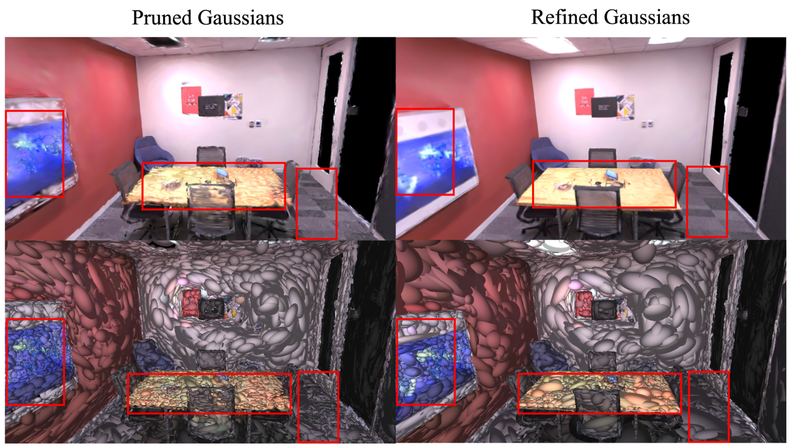

# PointSplat: Efficient Geometry-Driven Pruning and Transformer Refinement for 3D Gaussian Splatting

**[Paper](https://openaccess.thecvf.com/content/CVPR2026W/3DMV/papers/Tran_PointSplat_Efficient_Geometry-Driven_Pruning_and_Transformer_Refinement_for_3D_Gaussian_CVPRW_2026_paper.pdf)** | **[arXiv](https://arxiv.org/abs/2604.09903)**

**Anh Thuan Tran, Jana Kosecka** — George Mason University

<p align="center"></p>

## Abstract

We introduce **PointSplat**, a geometry-driven prune-and-refine framework for 3D Gaussian Splatting through feed-forward Point Transformer network. Without per-scene optimization, PointSplat achieves competitive rendering quality and superior efficiency across varying sparsity levels on ScanNet++ and Replica.

---

## Installation

```bash
git clone --recursive https://github.com/anhthuan1999/PointSplat.git
cd PointSplat

conda create -n poinsplat python=3.8 -y
conda activate poinsplat

# PyTorch (adjust for your CUDA version)
pip install torch==2.4.1 torchvision==0.19.1 torchaudio==2.4.1 --index-url https://download.pytorch.org/whl/cu121

# Pointcept (Point Transformer V3 backbone)
pip install Pointcept/

# Flash-Attention
pip install flash-attn --no-build-isolation

# Other dependencies
pip install -r requirements.txt

# gsplat (Gaussian rasterizer)
pip install git+https://github.com/nerfstudio-project/gsplat.git@v0.1.11

# Nerfstudio (custom fork with splatfacto modifications)
pip install git+https://github.com/ChenYutongTHU/nerfstudio_splatformer.git
```

---

## Data Preparation

PointSplat takes pre-trained 3DGS as input. We use [Nerfstudio](https://docs.nerf.studio/) (`splatfacto`) to generate initial Gaussians from multi-view images.

### Dataset structure

Organize each dataset in the following structure (COLMAP-compatible):

```
data/
├── scannetpp/
│   ├── <scene_id>/
│   │   ├── colmap/          # COLMAP sparse reconstruction
│   │   └── nerfstudio/      # Nerfstudio output (splatfacto)
└── replica/
    ├── <scene_id>/
    │   ├── colmap/
    │   └── nerfstudio/
```

### Generating initial 3DGS with Nerfstudio

Run `splatfacto` on each scene to produce initial Gaussians. Example for ScanNet++:

```bash
ns-train splatfacto \
    --pipeline.datamanager.data=data/scannetpp/<scene_id>/colmap \
    --pipeline.model.sh_degree=3 \
    --output_dir=data/scannetpp/<scene_id>/nerfstudio \
    --experiment-name=<scene_id> \
    --max_num_iterations=15000 \
    colmap \
    --downscale_factor=1 \
    --load_3D_points True \
    --auto_scale_poses=False --orientation_method=none --center_method=none \
    --eval_mode fraction
```

Update the data paths in the relevant `configs/dataset/*.gin` file before training.

---

## Training

Update the `nerfstudio_folder` and `colmap_folder` paths in the dataset config (e.g. `configs/dataset/pp.gin`) to point to your data.

**ScanNet++**
```bash
sh scripts/train_pp.sh
```

**Replica**
```bash
sh scripts/train_rep.sh
```

Each script calls `train.py` with the appropriate dataset, model, and training configs using the [gin](https://github.com/google/gin-config) configuration system. The key config files are:

| Config type | Files |
|---|---|
| Dataset | `configs/dataset/{pp,replica}.gin` |
| Model | `configs/model/ptv3.gin` |
| Training | `configs/train/default.gin`, `configs/train/defaultpp.gin` |

---

## Evaluation

After training, evaluate the model by passing `--only_eval` and pointing to a saved checkpoint:

**ScanNet++**
```bash
torchrun --nnodes=1 --nproc_per_node=1 --rdzv-endpoint=localhost:29500 \
    train.py \
    --only_eval --eval_subdir test --compare_with_input \
    --output_dir=outputs/scannetpp \
    --gin_file=configs/dataset/pp.gin \
    --gin_file=configs/model/ptv3.gin \
    --gin_file=configs/train/defaultpp.gin \
    --gin_param="FeaturePredictor.resume_ckpt='outputs/scannetpp/checkpoints/model_00009999.pth'"
```

**Replica**
```bash
torchrun --nnodes=1 --nproc_per_node=1 --rdzv-endpoint=localhost:29500 \
    train.py \
    --only_eval --eval_subdir test --compare_with_input \
    --output_dir=outputs/replica \
    --gin_file=configs/dataset/replica.gin \
    --gin_file=configs/model/ptv3.gin \
    --gin_file=configs/train/default.gin \
    --gin_param="FeaturePredictor.resume_ckpt='outputs/replica/checkpoints/model_00009999.pth'"
```

Evaluation metrics (PSNR, SSIM, LPIPS) are written to `outputs/<name>/test/<dataset>/metrics.rank0.json`.

---

## Citation

If you find this work helpful, please cite:

```bibtex
@InProceedings{Tran_2026_CVPR,
    author    = {Tran, Anh Thuan and Kosecka, Jana},
    title     = {PointSplat: Efficient Geometry-Driven Pruning and Transformer Refinement for 3D Gaussian Splatting},
    booktitle = {Proceedings of the IEEE/CVF Conference on Computer Vision and Pattern Recognition (CVPR) Workshops},
    month     = {June},
    year      = {2026},
    pages     = {330-339}
}
```

---

## Acknowledgements

This codebase is built on [SplatFormer](https://github.com/ChenYutongTHU/SplatFormer) and [Pointcept](https://github.com/Pointcept/Pointcept) (Point Transformer V3). We thank the respective authors for releasing their code.